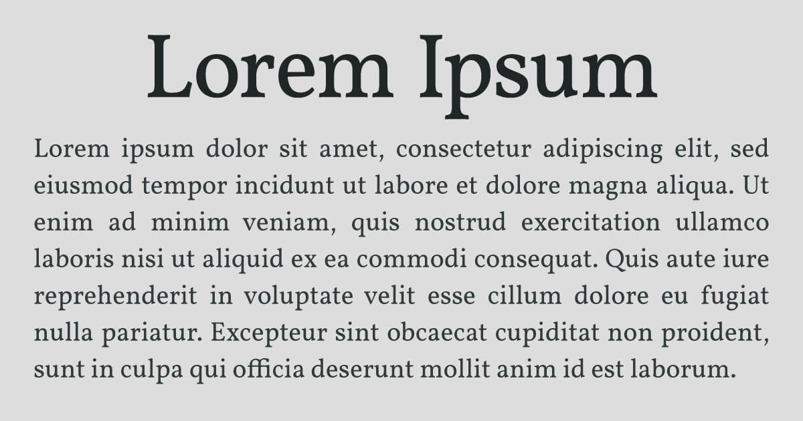
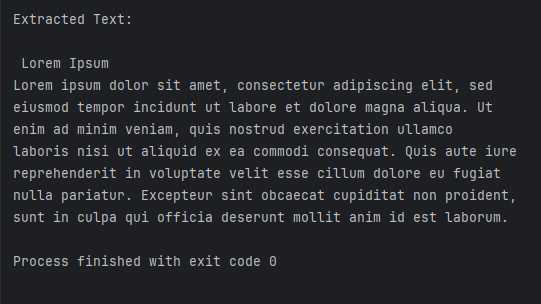

# [FREE OCR API](https://ocr.space/)

## Pre-requisites
- Pycharm / Visual Studio Code
- API Key

## Setup

1. Get your [API Key](https://ocr.space/OCRAPI)
2. Download the file and open it in your preferred IDE or code editor
3. Install the requests library in Python to make HTTP requests by typing the following command in the terminal:
   - pip install requests
4. Change the API key in the code to your API key
5. Run the program

## Sample Image

## Output

## Credits

This project is powered by the the free OCR API from [OCRSpace](https://ocr.space/) to extract text from image. 

A special thanks to OCRSpace for providing this powerful and free API.

## OCRSpace FAQ

Is it possible to use the free OCR service in a commercial project?
Yes, according to OCRSpace, you can use the free OCR API in a commercial project, but it comes with no uptime guarantees.

For more details, please visit the official OCRSpace FAQ page: [OCRSpace FAQ](https://ocr.space/faq).
